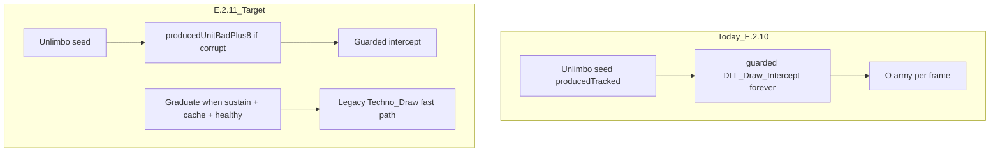

# E.2.11 Produced-Unit Graduation — Implementation Plan

> **Branch:** `experimental` only. **Stable** holds E.2.9/E.2.10 (promoted 2026-06-28, submodule `9ad2ae4`).

**Goal:** Restore acceptable late-game FPS by graduating healthy produced ground/sea units off eternal `DLL_Draw_Intercept`, without regressing E.2.8/E.2.9 aircraft stability.

**Evidence for need:** Soak `72db29b5-a2b7` — P4 PASS, 6.7k log lines, zero crashes, but user reports mid–late game "unacceptable" slowness. Root cause: `|| producedTracked` forces **all** WF/shipyard units onto guarded intercept every frame (569 produced units in session).

---

## Locked wins (do not re-litigate on experimental)

| ID | Status | Rule |
|----|--------|------|
| E.2.8 | DONE | Spy plane eternal pin |
| E.2.9 | PROMOTED STABLE | Rotor eternal pin; zero `BAD_PLUS8_CLEARED` |
| E.2.10 | PROMOTED STABLE | Placeholder log throttle + stab prune |

**Regression gate for every E.2.11 task:** 10-min spot check — deploy spy + Hind, grep zero `BAD_PLUS8_CLEARED`, no WER.

---

## Architecture



**Invariant after E.2.11:** Only slots with **actual** `producedUnitBadPlus8` (or early-starting / repurposed harvester rules) stay on guarded draw permanently. Healthy produced units graduate like starting units.

---

# Phase 1 — Low-risk overhead removal (P1)

## Task 1: Yellow marker graduation (deferred E.2.10 Task 8)

**File:** `Source/Rampastring-MoreQoL/REDALERT/CONQUER.CPP` — `DrawSafePlaceholder` (~4172)

**Change:** Skip `Fill_Rect` yellow box when object has graduated:

```cpp
bool skipMarker = false;
uintptr_t key = reinterpret_cast<uintptr_t>(object);
auto stabIt = g_AeloriaObjectStability.find(key);
if (stabIt != g_AeloriaObjectStability.end()
    && stabIt->second.stabilityLevel >= 2
    && Aeloria_HasValidMainDrawCache(object)) {
    skipMarker = true;
}
if (LogicPage != nullptr && !g_EarlyLoadGraceActive && !skipMarker) {
    LogicPage->Fill_Rect(...);
}
```

**Micro-gate G1:** Build OK; debug soak shows fewer `Fill_Rect` paths (no log — verify via sampling or frame time subjectively).

---

## Task 2: Demote BUILDING_STAB_REFRESH from critical logs

**File:** `Source/Rampastring-MoreQoL/REDALERT/DLLInterface.cpp` — `Aeloria_IsCriticalLogMessage` (~739)

**Change:** Remove `"BUILDING_STAB_REFRESH"` from critical prefix list. Log only when `g_AeloriaEnableVerboseDrawLogs` or once-per-building via new `AEL_LOG_BUILDING_STAB_REFRESH` tag in `OBJECT.H`.

**Evidence:** 2,257 disk writes in 34-min non-debug soak (`72db29b5`).

**Micro-gate G2:** Non-debug soak — `BUILDING_STAB_REFRESH` count &lt; 50.

---

## Task 3: Narrow human-house placeholder trigger

**File:** `Source/Rampastring-MoreQoL/REDALERT/CONQUER.CPP` — bad+8 block (~3919)

**Today:**
```cpp
|| (g_HumanPlayerHouse != HOUSE_NONE && object->Owner() == g_HumanPlayerHouse)
```

**Change:** Require actual bad+8 OR `Aeloria_NeedsSafeMainDrawGuard` — drop blanket human-house placeholder when `Is_Plausible_Class_Pointer(at_plus_8)`.

**Risk:** Medium — test human starting units + produced units with plausible +8.

**Micro-gate G3:** 15-min soak, human army visible, zero new WER offsets.

---

# Phase 2 — Produced-unit graduation (P0, main perf win)

## Task 4: Remove `|| producedTracked` from guarded predicate

**Files:**
- `Source/Rampastring-MoreQoL/REDALERT/UNIT.CPP` (~2224)
- `Source/Rampastring-MoreQoL/REDALERT/VESSEL.CPP` (~485)

**Today:**
```cpp
const bool producedBadPlus8 = eternalProduced
    || Aeloria_IsProducedBadPlus8Unit(selfObj)
    || producedTracked   // REMOVE THIS LINE
    || (bad_plus_8 && producedTracked);
```

**After:**
```cpp
const bool producedBadPlus8 = eternalProduced
    || Aeloria_IsProducedBadPlus8Unit(selfObj)
    || (bad_plus_8 && producedTracked);
```

Keep `producedTracked` for cache notify and `interceptShape = 0` only while **not graduated** (see Task 5).

---

## Task 5: Add `Aeloria_ProducedUnitMayUseLegacyDraw`

**File:** `Source/Rampastring-MoreQoL/REDALERT/OBJECT.H` (inline helper)

**Graduation criteria (all required):**
- `producedUnitUnlimboSeeded`
- `!producedUnitBadPlus8`
- `sustainRetired`
- `Aeloria_HasValidMainDrawCache(obj)`
- `Aeloria_TechnoClassRawIsHealthy(techno)` (for TechnoClass)
- Plausible runtime `+8`

**Use in UNIT.CPP / VESSEL.CPP:** If `Aeloria_ProducedUnitMayUseLegacyDraw`, fall through to existing fast `Techno_Draw_Object` / `DriveClass::Draw_It` path (same as non-produced units).

**Do NOT apply to RTTI_AIRCRAFT** — aircraft graduation stays aircraft-specific (E.2.9 rules).

**Log once:** `PRODUCED_UNIT_GRADUATED_LEGACY_DRAW` (add to critical list for validation).

---

## Task 6: VIRTUAL window parity

**Files:** `UNIT.CPP`, `VESSEL.CPP` VIRTUAL blocks

When graduated, VIRTUAL may use `Shape_Number()` / guarded shape from cache (like fixed-wing after E.2.2), not forced `interceptShape = 0`.

Mirror pattern from `AIRCRAFT.CPP` `mainCacheReady` handoff — produced units with valid cache use cached shape.

---

## Task 7: Build + commit

```powershell
Set-Location "C:\Users\jacks\Documents\CnCRemastered\Development"
# MSBuild Release x86 v145
.\Scripts\Launch-Aeloria.ps1 -Profile Experimental -BuildFirst -NC
```

Commits:
1. Submodule: `E.2.11: produced unit graduation + phase1 overhead removal`
2. Parent: `E.2.11 experimental: submodule bump`

---

# Validation — G-PERF (culmination)

**Launch:** Normal play (no `-DebugMode`)

```powershell
.\Scripts\Launch-Aeloria.ps1 -Profile Experimental -NC
```

**Play script:** 4p Aeloria, 20+ min, large army (same conditions that were "unacceptable").

| Gate | Pass |
|------|------|
| Subjective | User reports acceptable late-game feel |
| `PRODUCED_UNIT_GRADUATED_LEGACY_DRAW` | ≥ 50 events (graduation happening) |
| `BAD_PLUS8_CLEARED` | Zero |
| Spy + Hind 10-min spot | No crash, zero CLEAR |
| P4 analyzer | PASS |
| `PRODUCED_UNIT_FIRST_DRAW guarded=1` late frames | Declining vs E.2.10 baseline |

**Failure routing:**

| Symptom | Fix |
|---------|-----|
| Crash on WF unit after graduation | Tighten `MayUseLegacyDraw` — require `stabilityLevel >= 2` |
| Aircraft regression | Revert aircraft files only — never touch E.2.9 |
| Still slow, graduation logs OK | Task 1 yellow marker audit; profile `DLL_Draw_Intercept` count |
| Invisible produced units | Loosen graduation — require MAIN cache only, keep VIRTUAL guarded |

---

# Execution order

1. Task 2 (logging) — safest
2. Task 1 (yellow marker)
3. Task 4 + 5 + 6 (graduation core) — single PR
4. Task 3 (placeholder narrow) — after graduation soak passes
5. G-PERF soak

---

# Promotion policy

- **Do not** merge E.2.11 to `stable` until G-PERF passes + user sign-off on feel.
- Stable remains E.2.9/E.2.10 daily driver for crash-safe play (slow but finishable).